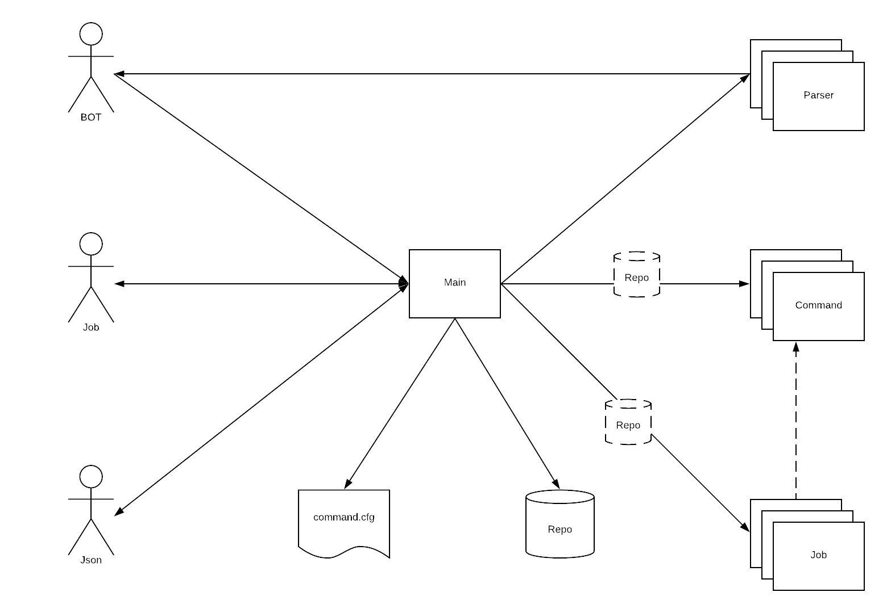

# Romário BOT

## O que é o Romário?

Romário é um político brasileiro ativo desde 2010. Ah, acho que ele jogou futebol em algum momento da carreira, também :-)

## Sério?

Brincadeira. Romário é o BOT multiuso da Centauro. É nosso atleta virtual ;)

Atualmente open source, escrito em Python e facilmente deployado em pataformas ccomo AWS LAMBDA. Mais importante, é uma aplicação facilmente customizável.

## O que ele faz?

Dificil dizer ainda...a ideia é utilizá-lo para ajudar tecnologia no dia a dia. Ainda Não sabemos exatamente o que faremos com isso, mas prometemos atualizar esse README enqaunto descobrimos.

## Como escrever novos comandos?

Fácil!

Inclua o comando no arquivo src/command.cfg. Use REGEX de forma que seu comando pareça um bate papo (Quão legal é perguntar "Peixe, dá uma checada nos grupos de emails que eu faço parte aí ou eu chamo o Bebeto!").

Uma vez que o comando está configurado, crie o arquivo com o código dele sob o diretório src/cmd/ (Garanta que ocomando tenha o mesmo nome do arquivo e da classe) e comece a codar :-)

## Mas como funciona?

É assim que os componentes interagem uns com os outros:

## Creditos

A base desse código foi criada enquanto eu trabalhava no Grupo ZAP (<https://github.com/grupozap>).

Contribuidores:

- Grupo ZAP Agile SuperHero Team.
- Vários outros, rode `git shortlog -s` para uma lista!

## Licença

This program is free software: you can redistribute it and/or modify it
under the terms of the GNU Affero General Public License as published by
the Free Software Foundation.
